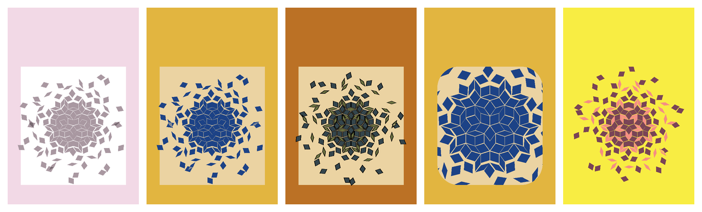
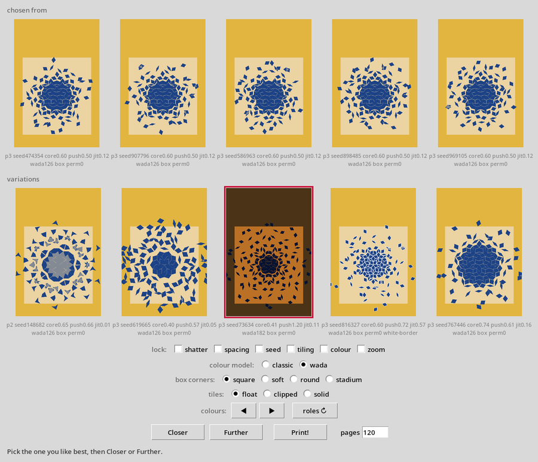

# shatter

Generates print-ready book covers: a **feature box** holding a "shattered"
aperiodic tiling — packed and intact at the centre, progressively flung outward
and rotated toward the rim, thinning into debris.

It renders **no text**. The type is set afterwards, by hand or by someone else.



## What it does

Output is a print-ready front, back or full wrap at a given trim size and DPI,
with bleed and a KDP spine-width calculation from the page count and paper stock.
Three aperiodic tiling families are available — Penrose P2 (kite/dart), Penrose P3
(rhombus) and Pinwheel.

Two **colour models**:

- **classic** — a plain pastel ground, a white or darkened box, tiles in one of
  three derived shades. Deliberately plain; this is what the tool was built around.
- **wada** — palettes drawn from Sanzo Wada's *A Dictionary of Color
  Combinations*: 159 colours across 348 combinations, mapped onto three role
  layouts and screened by a perceptual contrast floor in CIELAB, which is what
  stops the mode offering you an invisible tiling. 3,392 assignments in all.

Two **composition looks**, one flag apart: by default the flung tiles spill past
the feature box and float on the plain ground; with `--clip-tiles` they stop dead
at its edge. A negative `--box-margin` overfills the box so the tiles reach its
corners.

## Install

Python 3.10+. The only runtime dependency is Pillow.

```bash
python -m venv .venv
.venv/bin/pip install -e .
```

## Use

```bash
# a front cover, in each colour model
shatter generate --only front --out ./output/classic
shatter generate --mode wada --only front --out ./output/wada

# a full print-ready wrap: 6x9in, 300dpi, 120 pages of cream stock
shatter generate --only wrap --trim 6x9 --dpi 300 --pages 120 --paper cream

# the solid look, with rounded corners
shatter generate --clip-tiles --box-margin -0.1 --box-corner 0.2 --only front

# every setting is a field of one JSON recipe, so a cover reproduces exactly
shatter generate --emit-config cover.json --out ./output
shatter generate --config cover.json --out ./output
```

`shatter --help` lists the four subcommands: `generate`, `render` (from a saved
layout), `contact` (a labelled sheet of variations) and `choose`.

## Choosing a cover

The interesting part. Rather than tuning a dozen numbers, you **breed** covers:
look at candidates, pick the best, get variations of it, repeat.

```bash
shatter choose --mode wada
```



`Closer` makes small mutations around your selection and `Further` makes large
ones. Six **genes** — shatter, spacing, seed, tiling, colour and zoom — can each be
locked, so you can hold the palette still while hunting an arrangement, or the
reverse. Every child is guaranteed to differ from its parent however much is
locked, so a row never wastes a slot on a copy.

Breeding finds palettes by surprise. The **colour dial** (`◀ ▶`) is the other
half: it walks the whole palette space in hue order, five at a time, so a
half-remembered scheme can be hunted down rather than waited for. `roles` cycles
how a combination's colours are assigned to the background, box and tiles.

## Design notes

[`SHATTER_DESIGN.md`](SHATTER_DESIGN.md) is the specification of record, and is
kept current. Section 12.1 records **26 design decisions** with their reasoning —
including several that were reversed by measurement partway through, and why.
It is long, but it is the honest account of how the thing was built.

## Licence

MIT — see [LICENSE](LICENSE).

The vendored Sanzo Wada dataset (`src/shatter/data/`) is separately MIT licensed
and carries its own attribution in `src/shatter/data/SOURCE.md`, which must be
kept alongside it. The underlying colour combinations are from Sanzo Wada's
*A Dictionary of Color Combinations* (1933, public domain), digitised by
[dblodorn/sanzo-wada](https://github.com/dblodorn/sanzo-wada) and corrected by
[mattdesl/dictionary-of-colour-combinations](https://github.com/mattdesl/dictionary-of-colour-combinations).
